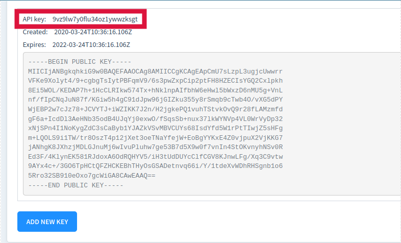

# C# API v2 examples

The examples below are compliant with [**Walutomat API v2 Documentation**](https://api.walutomat.pl/v2.0.0/ )

### RSA Key pair
To generate an RSA key pair execute the following commands:

```bash
$ openssl genrsa -out ./private.key 4096
$ openssl rsa -in ./private.key -pubout -out ./public.key
```

### API KEY
Once the RSA Key pair is generated, the API KEY can be obtained in your **Walutomat** account. Make sure to use the **public.key**. The API KEY can be seen **only once**.


When the API KEY is generated, copy its value to **./api_key** and save the file.

---
## Examples

### [Return wallet balance](https://api.walutomat.pl/v2.0.0/#operation/getBalances)

```bash
$ dotnet run wallet-balance
```
Output:
```
{
   "success":true,
   "result":[
      {
         "currency":"PLN",
         "balanceTotal":"555555481997.00",
         "balanceAvailable":"555555481231.24",
         "balanceReserved":"765.76"
      },
      {
         "currency":"EUR",
         "balanceTotal":"2055030.46",
         "balanceAvailable":"2055030.46",
         "balanceReserved":"0.00"
      }
   ]
}
```

### [Create order](https://api.walutomat.pl/v2.0.0/#operation/newOrder)

```bash
$ dotnet run order-create
```
Output:
```
{
   "success":true,
   "duplicate":false,
   "result":{
      "orderId":"c9bd63ef-7988-4ea3-9d26-b3d0f5b2b3f9"
   }
}
```

### [Withdraw order](https://api.walutomat.pl/v2.0.0/#operation/cancelOrder)

To withdraw an order, it needs to be created beforehand. Please use the **create-order** API for that. Once orderId is returned, run the command below:

```bash
$ dotnet run order-withdraw {orderId}
```
Output:
```
{
   "success":true,
   "errors":[

   ],
   "result":{
      "orderId":"c9bd63ef-7988-4ea3-9d26-b3d0f5b2b3f9",
      "submitId":"ffaeb678-7ef8-4850-ba1b-7ecebf844710",
      "submitTs":"2020-03-24T09:31:53.285691Z",
      "updateTs":"2020-03-24T09:33:32.230450Z",
      "status":"CLOSED",
      "completion":0,
      "currencyPair":"EURPLN",
      "buySell":"BUY",
      "volume":"90.00",
      "volumeCurrency":"EUR",
      "limitPrice":"4.2456",
      "soldAmount":"0.00",
      "soldCurrency":"PLN",
      "boughtAmount":"0.00",
      "boughtCurrency":"EUR",
      "commissionRate":"0.0020"
   }
}
```

### [Return active orders](https://api.walutomat.pl/v2.0.0/#operation/findActiveOrders)
```bash
$ dotnet run orders-active
```
Output:
```
{
   "success":true,
   "result":[
      {
         "orderId":"070620ac-a8df-41f9-81fb-23364485cb3a",
         "submitId":"3ab310db-9ce4-49d6-b8c4-5ed7875bca95",
         "submitTs":"2020-03-23T15:09:16.039163Z",
         "updateTs":"2020-03-23T15:09:16.201646Z",
         "status":"ACTIVE",
         "completion":0,
         "currencyPair":"EURPLN",
         "buySell":"BUY",
         "volume":"90.00",
         "volumeCurrency":"EUR",
         "limitPrice":"4.2456",
         "soldAmount":"0.00",
         "soldCurrency":"PLN",
         "boughtAmount":"0.00",
         "boughtCurrency":"EUR",
         "commissionRate":"0.0020"
      },
      {
         "orderId":"0dd866a6-51dd-429b-9e85-f9d202b173d2",
         "submitId":"7663343e-918f-475f-99c0-9e0a8443df11",
         "submitTs":"2020-03-23T14:30:04.905401Z",
         "updateTs":"2020-03-23T14:30:05.074236Z",
         "status":"ACTIVE",
         "completion":0,
         "currencyPair":"EURPLN",
         "buySell":"BUY",
         "volume":"90.00",
         "volumeCurrency":"EUR",
         "limitPrice":"4.2456",
         "soldAmount":"0.00",
         "soldCurrency":"PLN",
         "boughtAmount":"0.00",
         "boughtCurrency":"EUR",
         "commissionRate":"0.0020"
      }
   ]
}
```
